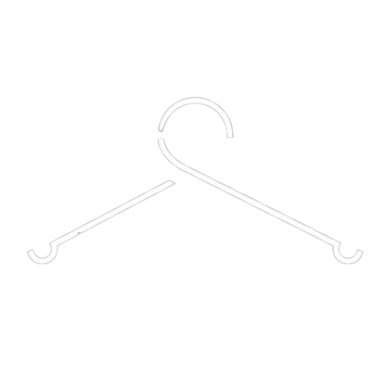

<h1 align="center">
  MERO CLOSET
</h1>

  The Ultimate Luxury Abaya & Fashion Store.

---

## 🚀 About This Project

This corresponds to the backend and frontend monorepo for **MERO CLOSET**, a modern e-commerce platform built with **Medusa.js**.

- **Backend:** Medusa v2 (Deployed on Koyeb)
- **Database:** Neon (PostgreSQL)
- **Frontend:** Next.js Storefront (Deployed on Vercel)
- **Storage:** Cloudinary

## 🛠 Project Structure

- `my-medusa-store/`: The backend server code (Medusa).
- `mero-frontend/`: The storefront frontend code (Next.js).

## 👨‍💻 Developed By

**Eng. Mohamed Alromaihi**
